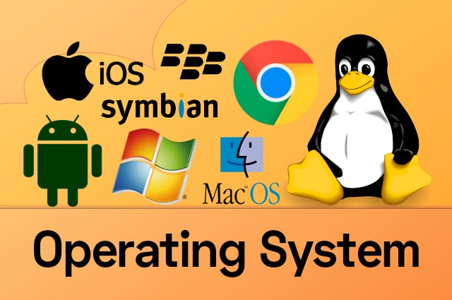

# **Operating System**

## _**Table of Content**_

| **Unit** |                                  **Title**                                 |
|:--------:|:--------------------------------------------------------------------------:|
|    1     |[**``Introduction to Operating System``**](Unit/Unit-1.md)                  |
|    2     |[**``Operating System Structure``**](Unit/Unit-1.md)                        |
|    3     |[**``Process Management``**](Unit/Unit-1.md)                                |
|    4     |[**``Deadlock``**](Unit/Unit-1.md)                                          |
|    5     |[**``Memory Management``**](Unit/Unit-1.md)                                 |
|    6     |[**``Input/Output Device Management``**](Unit/Unit-1.md)                    |
|    7     |[**``File System Interface Management``**](Unit/Unit-1.md)                  |
|    8     |[**``Security Management``**](Unit/Unit-1.md)                               |
|    9     |[**``Distributed Operating System``**](Unit/Unit-1.md)                      |
|    10    |[**``Case Study``**](Unit/Unit-1.md)                                        |

